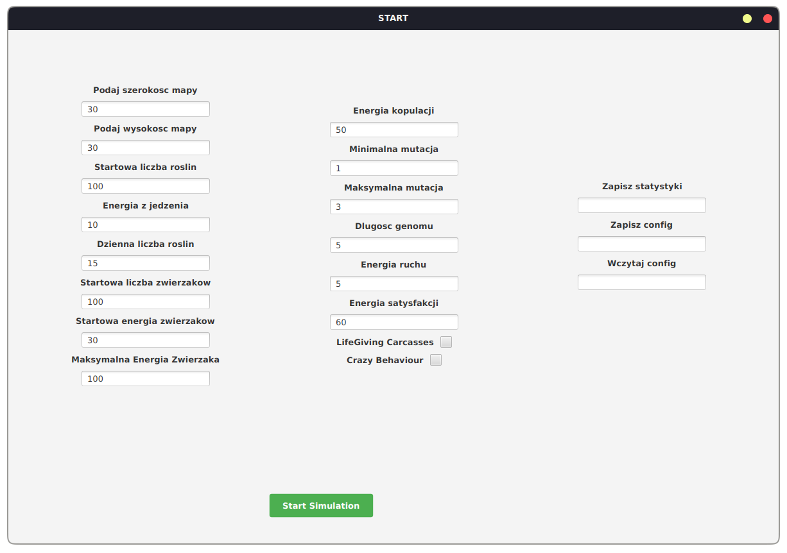
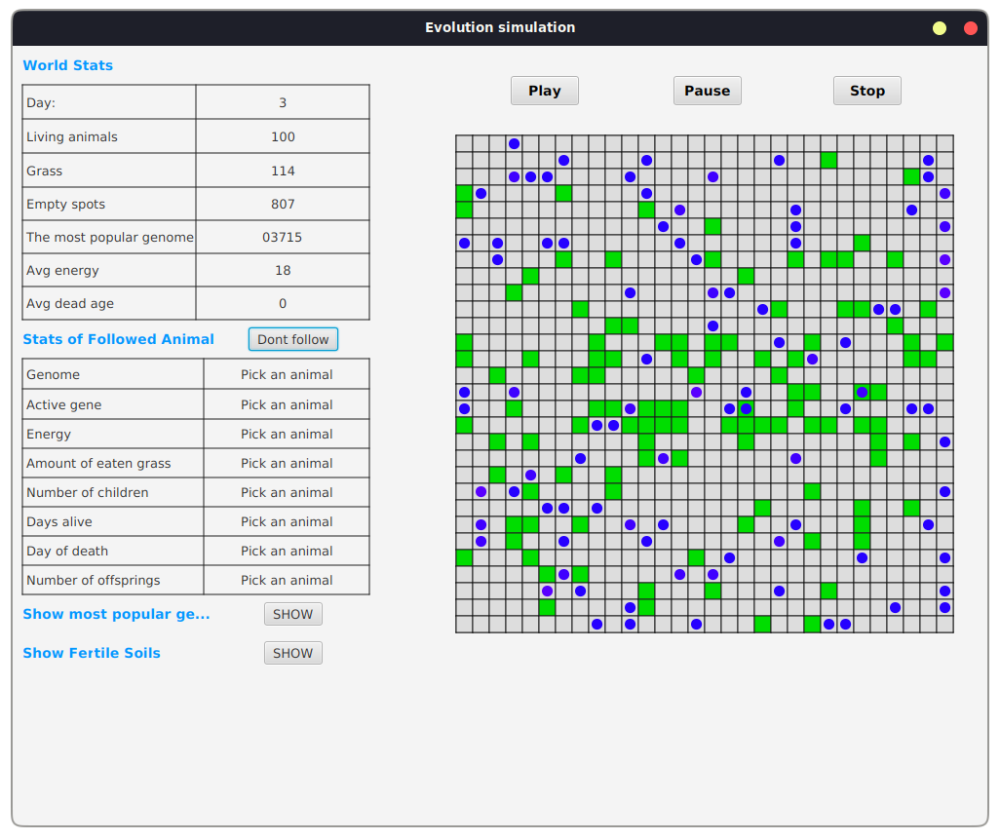

# 🦁 Darwin World – Symulacja Świata  

## 📖 Opis projektu  
**Darwin World** to interaktywna symulacja, w której użytkownik może definiować różne parametry środowiska i obserwować, jak zwierzęta ewoluują oraz wchodzą w interakcje z otoczeniem.  
Celem projektu jest odwzorowanie podstawowych zasad ewolucji, przetrwania i ruchu organizmów w dynamicznym świecie.  

## 🎮 Funkcjonalności  
✔️ Możliwość konfiguracji parametrów świata (np. rozmiar mapy, liczba roślin, energia zwierząt)  
✔️ Symulacja ruchu i ewolucji organizmów  
✔️ Mechanika mutacji i rozmnażania  
✔️ Dynamiczne zmiany ekosystemu w zależności od warunków  

## 🖼️ Zrzuty ekranu  
### Panel konfiguracji  
  

### Symulacja w trakcie działania  
  
